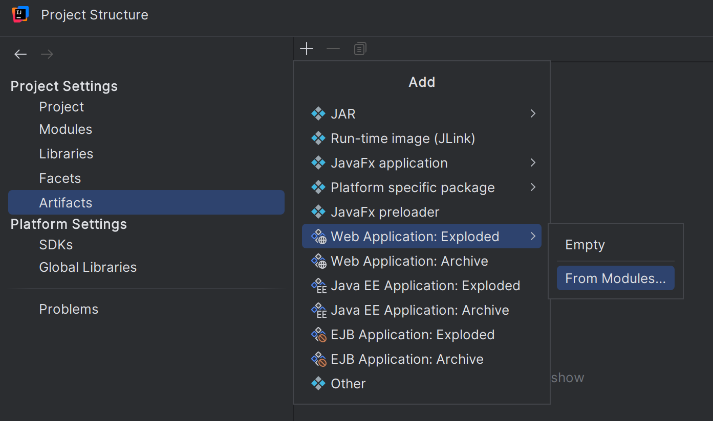
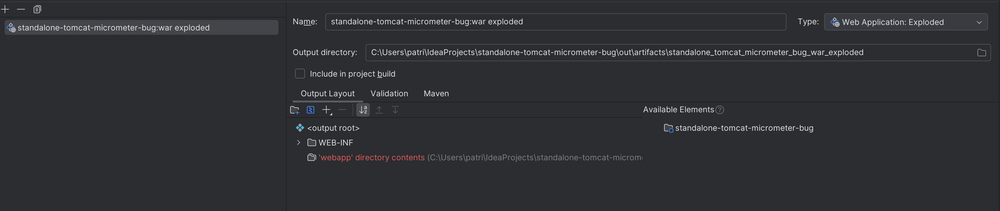
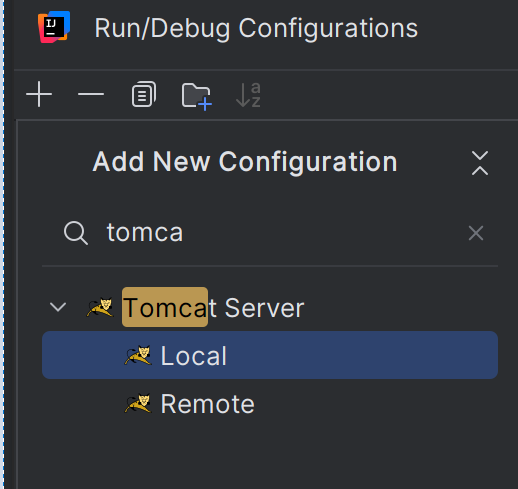
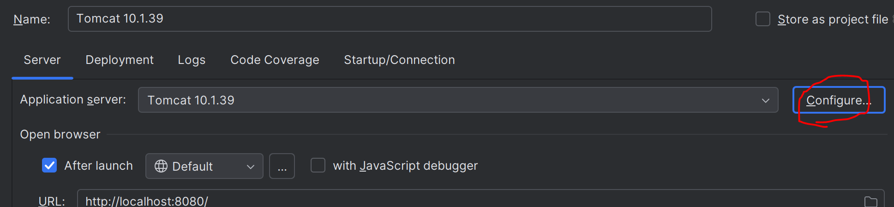
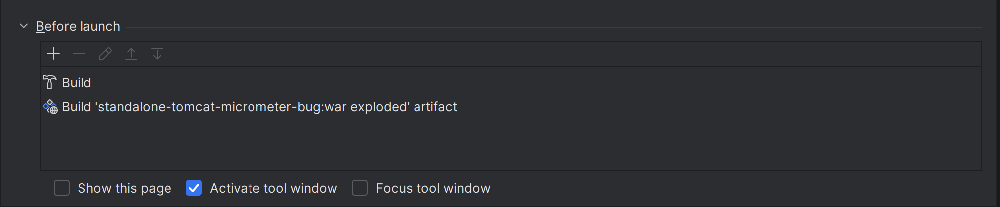
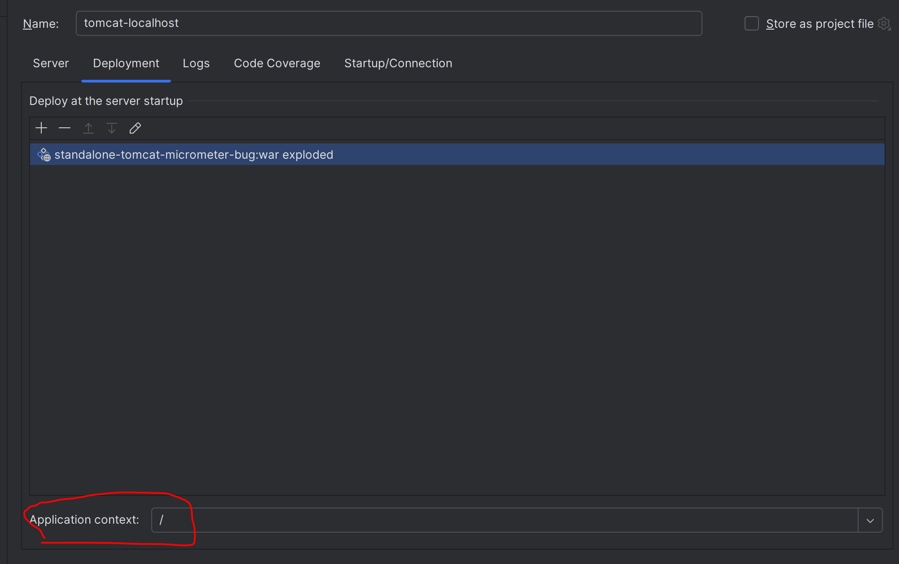

# standalone-tomcat-micrometer-bug
Example of problem with Micrometer's built in instrumentation 
for Tomcat when deploying to standalone Tomcat

The problem is line 21 of this class: [MetricsServlet](https://github.com/plilja/standalone-tomcat-micrometer-bug/blob/main/src/main/java/se/plilja/MetricsServlet.java)

You don't really need to start the application to reproduce the 
problem. Since the problem occurs at compile time.

However, if you still want to start the application. 
You can either build using maven and deploy the war file
to a Tomcat instance. Or you can start using IntelliJ Enterprise
Edition using the following steps:

1. Download Tomcat and unpack somewhere on your hard drive
2. Open project structure and create an artifact for the exploded WAR file.
   - 
3. It should look like this
   - 
4. Create a new run config for a local Tomcat server
   - 
5. Setup the Tomcat server you downloaded in step 1. Click red circle and enter the folder from step 1.
   - 
6. In the "Before launch" section. Add the artifact from step 2.
   - 
7. In the deployment section, change the application context to "/"
   - 
8. Run, metrics endpoint can be found on http://localhost:8080/metrics